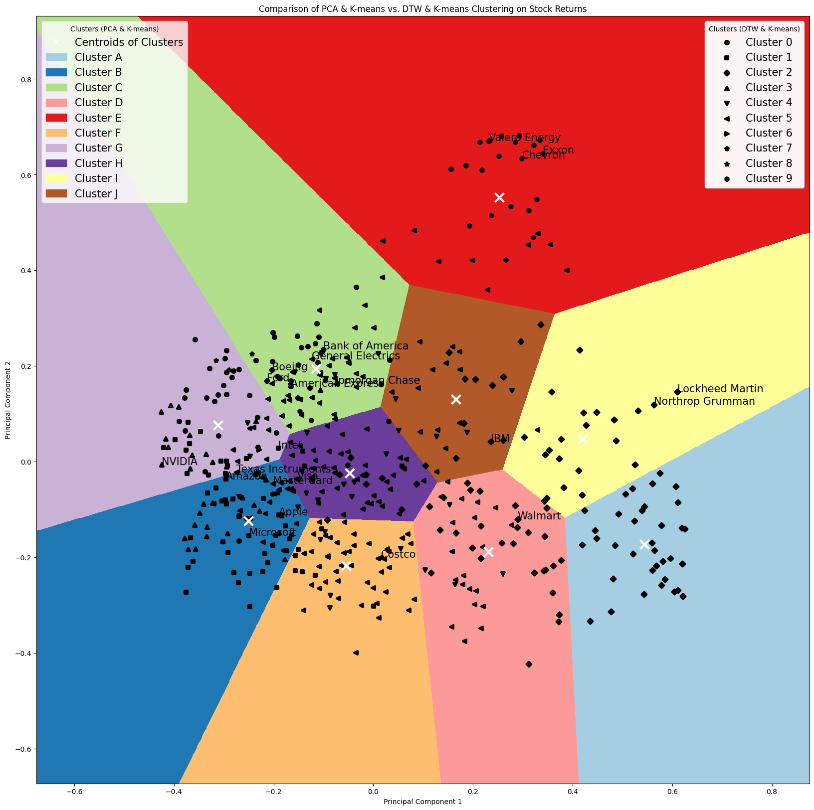

# Stock Clustering Analysis: Comparing PCA + K-means and DTW + K-means

## Project Overview
The project aims to cluster stocks based on their return patterns using two methods: PCA + K-means and DTW + K-means. The study will compare the results to highlight the strengths of each approach.

1. **PCA (Principal Component Analysis) + K-means**: PCA is used for dimensionality reduction, followed by K-means clustering.
2. **DTW (Dynamic Time Warping) + K-means**: DTW is used to measure the similarity between temporal sequences, followed by K-means clustering.

This study provides insights into the advantages of using DTW for clustering temporal data in financial markets, demonstrating its ability to account for lead-lag effects and other temporal relationships that PCA might overlook. 

**Data Period**: January 1, 2022, to December 31, 2022

### Lead-Lag Effects in Financial Markets
Lead-lag effects are prevalent in stock markets. For example, large-cap stocks often lead small-cap stocks within sectors due to their quicker reactions to market news and economic changes. This is attributed to their higher liquidity, better access to information, and extensive analyst coverage. Similarly, within supply chains, upstream companies may lead downstream companies due to their earlier exposure to raw material price changes and demand signals.

## Visualization

From the graph below, I compare the results from two clustering methods:

- **PCA + K-means**
  - Represented by colored regions (Clusters A to J) as shown in the upper-left legend ("Clusters (PCA & K-means)").
  - Stocks are grouped based on their principal component scores, reflecting contemporaneous co-movement.
  - The centroids of these clusters are marked with white crosses.
- **DTW + K-means**
  - Represented by different markers (circles, squares, diamonds, etc.) as illustrated by the upper-right legend ("Clusters (DTW & K-means)").
  - This method captures not only contemporaneous co-movement but also lead-lag relationships and other temporal shifting patterns.
  - Stocks with similar DTW-based clusters have the same marker but may be dispersed across different PCA-based clusters.

### Here are the Key Insights and Observations:

Key Insights :
- Contemporaneous Co-movement: PCA & K-means primarily capture contemporaneous co-movement, grouping stocks that move together at the same time.
- Temporal Relationships: DTW & K-means can capture more complex temporal relationships, including lead-lag effects, which are not limited to contemporaneous movements.
- Cluster Dispersion: The dispersion of similar markers across different colored regions indicates that DTW & K-means can identify stocks with similar temporal dynamics even if they do not move together simultaneously.

#### Observations

- Cluster 2 (diamond marker) by DTW + K-means is mostly located at the bottom right of the graph, corresponding to Cluster I and A (light yellow and light blue) by PCA + K-means.
- Cluster 0 (circle marker) by DTW + K-means is mostly located at the top left of the graph, corresponding to Cluster C and G (light green, light purple) by PCA + K-means.

Based on the list of companies concerned, let's observe the result through economic sectors:

- **Energy Sector (Valero Energy, Chevron, and Exxon):**
  - Both methods cluster the target energy companies into the same group. PCA maps them to the top of the graph in the red area (Cluster E by the PCA + K-means methods), while the DTW + K-means method identifies them as Cluster 9 (hexagon marker).
- **Aerospace and Defense Stocks (Boeing, Lockheed Martin, Northrop Grumman):**
  - PCA maps Lockheed Martin and Northrop Grumman in Cluster I (light yellow). DTW + K-means clusters them in Cluster 2 (diamond marker).
  - Boeing is mapped closer to the Banking Industries based on both PCA and DTW methods.
- **Financial Services (American Express, Bank of America, JPMorgan Chase, MasterCard, Visa):**
  - PCA maps banks closely together (light green). DTW + K-means clusters Bank of America and American Express in Cluster 0 (circle marker) and JPMorgan Chase, MasterCard, and Visa in Cluster 5 (left-pointing black triangle).
- **Tech Stocks:**
  - PCA + K-means clusters Amazon, Apple, MasterCard, Microsoft, and Texas Instruments in the same group (dark blue) and Intel and Nvidia in the same group (light purple).
  - DTW + K-means clusters Amazon, Apple, Intel, and Microsoft in the same group.

PCA + K-means captures the overall trends similarly to DTW + K-means, but DTW + K-means can also capture temporal-shifting/lead-lag effects. A comprehensive analysis should utilize both methods.

## Discussion:
There is no definitive right or wrong method to use; the choice depends on the application and the researcher's or practitioner's goals:

PCA & K-means: This approach is more straightforward and easier to interpret but may omit certain relationships. It is useful when the focus is on contemporaneous co-movement.

DTW & K-means: This method incorporates more information about temporal relationships but requires more effort to interpret and determine causation. It is beneficial for capturing complex temporal dynamics that PCA might miss.

This comparison highlights the trade-offs between simplicity and comprehensiveness in clustering stock returns, guiding researchers and practitioners in choosing the appropriate method for their specific needs.

## Detailed Clustering Results 
Note: The names of the clusters do not indicate any order or ranking; they merely represent different categories or groups.

### PCA + K-means
The clustering based on PCA + K-means resulted in the following clusters:

- **Cluster 0:** 27 stocks  
  ADM, APA, BG, BKR, CF, COP, CTRA, CTVA, CVX, DVN, EOG, EQT, FANG, HAL, HES, KMI, MOS, MPC, MRO, OKE, OXY, PSX, SLB, TRGP, VLO, WMB, XOM
- **Cluster 1:** 53 stocks  
  ABBV, ACGL, AIZ, ALL, AMGN, AZO, BAX, BDX, BIIB, BMY, CAH, CB, CBOE, CHTR, CI, CINF, CMCSA, CME, CNC, COR, CVS, DVA, EG, ELV, GEN, GILD, HCA, HSIC, HUM, IBM, INCY, LLY, MCD, MCK, MDT, MOH, MRK, NEM, ORLY, PFE, PGR, REGN, RTX, STZ, T, TMUS, TRV, UHS, UNH, VRTX, VZ, WBA, WRB
- **Cluster 2:** 26 stocks  
  AMT, ARE, AVB, BXP, CCI, CPT, DLR, DOC, EQIX, EQR, ESS, EXR, FRT, INVH, IRM, KIM, MAA, O, PLD, PSA, REG, SBAC, UDR, VICI, VTR, WELL
- **Cluster 3:** 87 stocks  
  ADP, AES, AJG, AKAM, ALLE, AMCR, AME, AON, AOS, APD, BALL, BBY, BLDR, BLK, BR, BRO, CARR, CHRW, COST, CSCO, CSX, CTAS, DG, DHI, DLTR, DOV, EBAY, ECL, EFX, ETN, EXPD, FAST, FDS, FI, FTV, GPC, GRMN, GWW, HD, HON, HUBB, ICE, IEX, ITW, J, JBHT, JCI, JKHY, LEN, LOW, MAS, MLM, MMC, MMM, MNST, MSI, NDAQ, NDSN, NRG, NSC, NVR, ODFL, ORCL, OTIS, PAYX, PHM, PNR, POOL, PWR, ROK, ROL, ROP, ROST, SHW, TDY, TGT, TSCO, TT, UNP, UPS, VMC, VRSK, VRSN, WTW, WY, XYL, YUM
- **Cluster 4:** 35 stocks  
  AEE, AEP, ATO, AWK, CMS, CNP, D, DTE, DUK, ED, EIX, ES, ETR, EVRG, EXC, FE, GD, HII, LDOS, LHX, LMT, LNT, NEE, NI, NOC, PEG, PNW, PPL, RSG, SO, SRE, VST, WEC, WM, XEL
- **Cluster 5:** 102 stocks  
  AAL, AFL, AIG, ALB, AMP, APTV, AVY, AXP, BA, BAC, BEN, BK, BKNG, BWA, C, CAT, CBRE, CE, CFG, CMI, COF, CPAY, DAL, DD, DE, DFS, DOW, EMN, EMR, F, FCX, FDX, FITB, FMC, FOX, FOXA, GE, GL, GLW, GM, GS, HBAN, HIG, HLT, HPE, HST, HWM, IFF, IP, IPG, IR, IVZ, JPM, KEY, L, LIN, LKQ, LUV, LW, LYB, MAR, MET, MHK, MS, MTB, NTRS, NUE, NWS, NWSA, OMC, PARA, PCAR, PCG, PFG, PH, PKG, PNC, PPG, PRU, RF, RJF, RL, SCHW, SNA, SPG, STLD, STT, SWK, SYF, SYY, TDG, TFC, TJX, TPR, TXT, UAL, URI, USB, VTRS, WAB, WFC, WRK
- **Cluster 6:** 25 stocks  
  CAG, CHD, CL, CLX, CPB, GIS, HRL, HSY, JNJ, K, KDP, KHC, KMB, KO, KR, MDLZ, MKC, MO, PEP, PG, PM, SJM, TAP, TSN, WMT
- **Cluster 7:** 56 stocks  
  ABNB, ADSK, AMZN, ANSS, AXON, BBWI, BX, CCL, CMG, CPRT, CRM, CRWD, CSGP, CZR, DAY, DECK, DIS, DPZ, DRI, DXCM, ENPH, EPAM, ETSY, EXPE, FICO, FSLR, FTNT, GDDY, GNRC, INTU, IT, KMX, LULU, LVS, LYV, MGM, MKTX, MRNA, MTCH, NCLH, NFLX, NOW, PANW, PAYC, PODD, PTC, PYPL, RCL, SBUX, TSLA, TTWO, TYL, UBER, ULTA, WBD, WYNN
- **Cluster 8:** 53 stocks  
  AAPL, ACN, ADBE, ADI, AMAT, AMD, ANET, APH, AVGO, CDNS, CDW, CTSH, EA, EL, FFIV, FIS, GOOG, GOOGL, GPN, HAS, HPQ, INTC, JBL, JNPR, KEYS, KKR, KLAC, LRCX, MA, MCHP, META, MPWR, MSFT, MU, NKE, NTAP, NVDA, NXPI, ON, QCOM, QRVO, SMCI, SNPS, STX, SWKS, TEL, TER, TRMB, TROW, TXN, V, WDC, ZBRA
- **Cluster 9:** 31 stocks  
  A, ABT, ALGN, BIO, BSX, COO, CRL, CTLT, DGX, DHR, EW, HOLX, IDXX, IQV, ISRG, LH, MCO, MSCI, MTD, RMD, RVTY, SPGI, STE, SYK, TECH, TFX, TMO, WAT, WST, ZBH, ZTS

### DTW + K-means
The clustering based on DTW + K-means resulted in the following clusters:

- **Cluster 0:** 55 stocks  
  AAL, ALB, AMP, APTV, AXP, BA, BAC, BEN, BKNG, BWA, CE, CFG, COF, CSGP, DAL, DECK, DFS, EXPE, F, FCX, FITB, FSLR, GM, HBAN, HLT, HPQ, HST, IVZ, JBL, KEY, KKR, LUV, LVS, LYV, MAR, MGM, MU, NUE, PARA, RF, RL, STLD, STT, STX, SYF, TFC, TPR, UAL, VTRS, WDC, WFC, WYNN
- **Cluster 1:** 57 stocks  
  AAPL, ADBE, ADI, AMAT, AMZN, ANET, ANSS, AVGO, BBY, BIIB, BIO, BLDR, BX, CDNS, CMG, CPRT, CRL, DHI, EBAY, EFX, EL, EQIX, FICO, GOOG, GOOGL, HD, IDXX, INTC, ISRG, KLAC, LEN, LOW, LULU, MAS, MCHP, MCO, MHK, MSCI, MSFT, NKE, NVR, NXPI, ODFL, PANW, PHM, PODD, POOL, PTC, QCOM, QRVO, ROST, RVTY, SBUX, SNPS, SWK, SWKS, TECH, TRMB, TROW, TYL
- **Cluster 2:** 105 stocks  
  ABBV, AEE, AEP, AMGN, ATO, AWK, AZO, BAX, BDX, BMY, CAG, CAH, CB, CBOE, CHD, CI, CINF, CL, CLX, CMCSA, CME, CMS, CNP, COR, CPB, CVS, D, DGX, DTE, DUK, EA, ED, EIX, ELV, ES, ETR, EVRG, EXC, FE, GD, GEN, GILD, GIS, HII, HRL, HSIC, HSY, IBM, INCY, JKHY, JNJ, K, KDP, KHC, KMB, KO, KR, L, LDOS, LHX, LLY, LMT, LNT, LW, MCD, MCK, MDLZ, MDT, MKC, MO, MOH, MRK, NI, NOC, O, ORLY, PEG, PEP, PFE, PG, PGR, PM, PNW, PPL, RSG, RTX, SJM, SO, SRE, STZ, T, TAP, TMUS, TRV, TSN, UNH, VICI, VZ, WEC, WM, WMT, WRB, XEL, YUM
- **Cluster 3:** 28 stocks  
  ABNB, ADSK, ALGN, AMD, AXON, BBWI, CRM, CRWD, CZR, DAY, DXCM, ENPH, ETSY, FTNT, GNRC, INTU, LRCX, META, MPWR, MRNA, MTCH, NOW, NVDA, ON, PAYC, PYPL, SMCI, TER, TSLA, UBER
- **Cluster 4:** 6 stocks  
  AIZ, ALL, BALL, BRO, CHRW, CHTR, CTLT, CTSH, DIS, DVA, EW, EXR, FDX, FIS, FOX, FOXA, GDDY, GPN, INVH, IRM, KMX, MTB, NRG, PSA, ROK, TGT, TTWO, WST, ZBRA, ZTS
- **Cluster 5:** 180 stocks  
  A, ABT, ACGL, ACN, ADM, ADP, AES, AFL, AIG, AJG, AKAM, ALLE, AMCR, AME, AMT, AON, AOS, APD, APH, ARE, AVB, AVY, BG, BK, BLK, BR, BSX, BXP, C, CARR, CAT, CBRE, CCI, CDW, CMI, CNC, COO, COST, CPAY, CPT, CSCO, CSX, CTAS, CTVA, DD, DE, DG, DHR, DLR, DLTR, DOC, DOV, DOW, DPZ, DRI, ECL, EG, EMN, EMR, EQR, ESS, ETN, EXPD, FAST, FDS, FFIV, FI, FMC, FRT, FTV, GE, GL, GLW, GPC, GRMN, GS, GWW, HAS, HCA, HIG, HOLX, HON, HPE, HUBB, HUM, HWM, ICE, IEX, IFF, IP, IPG, IQV, IR, IT, ITW, J, JBHT, JCI, JNPR, JPM, KEYS, KIM, KMI, LH, LIN, LKQ, LYB, MA, MAA, MET, MKTX, MLM, MMC, MMM, MNST, MS, MSI, MTD, NDAQ, NDSN, NEE, NEM, NSC, NTAP, NTRS, NWS, NWSA, OKE, OMC, ORCL, OTIS, PAYX, PCAR, PCG, PFG, PH, PKG, PLD, PNC, PNR, PPG, PRU, PWR, REG, REGN, RJF, RMD, ROL, ROP, SBAC, SCHW, SHW, SNA, SPG, SPGI, STE, SYK, SYY, TDG, TDY, TEL, TFX, TJX, TMO, TSCO, TT, TXN, TXT, UDR, UHS, ULTA, UNP, UPS, URI, USB, V, VMC, VRSK, VRSN, VRTX, VST, VTR, WAB, WAT, WBA, WELL, WMB, WRK, WTW, WY, XYL, ZBH
- **Cluster 6:** 1 stock  
  NFLX
- **Cluster 7:** 2 stocks  
  EPAM
- **Cluster 8:** 3 stocks  
  CCL, NCLH, RCL
- **Cluster 9:** 13 stocks  
  APA, BKR, CF, COP, CTRA, CVX, DVN, EOG, EQT, FANG, HAL, HES, MOS, MPC, MRO, OXY, PSX, SLB, TRGP, VLO, WBD, XOM

