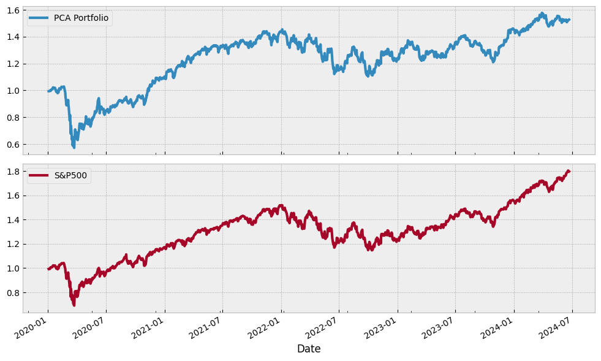

# Principal Component Analysis (PCA) on Stock Market

## Executive Summary

This project demonstrates the application of Principal Component Analysis (PCA) to stock market data. The analysis showcases how to leverage PCA to identify major risks and factors influencing asset returns, reconstruct component portfolios, and backtest the suggested portfolios. This study focuses on the first principal component, with similar procedures applicable to the second and third components.

## Outline

1. **Introduction to PCA on Asset Returns**
2. **Exploratory Data Analysis (EDA)**
3. **Applying PCA to Stock Returns**
4. **Reconstructing Component Portfolios**
5. **Constructing Portfolios through PCA Filtering**
6. **Backtesting PCA-Suggested Portfolios**
7. **Discussion and Limitations**

## Introduction

In this study, Principal Component Analysis (PCA) is directly applied to stock return series without first calculating the covariance matrix. Although this approach may introduce some noise, it allows PCA to capture the temporal information inherent in the data, unlike the traditional method that relies on the covariance matrix and only provides static information. Further improvements and variations of PCA are discussed in the "Discussion and Limitations" section.

## Exploratory Data Analysis (EDA)

Initial data analysis is conducted to understand the structure and characteristics of the stock market data.

## Applying PCA to Stock Returns

PCA is applied to the stock returns data to extract the principal components and analyze how much variance each component explains.

## Reconstructing Component Portfolios

Based on the PCA loadings, portfolios aligned with the extracted components are reconstructed. This step involves understanding the economic significance of the PCA weights. (Note: This study focuses on the first principal component, with similar procedures applicable to the second and third components.)

## Constructing Portfolios through PCA Filtering

Using PCA weights, portfolios that are least sensitive or even negatively correlated to the primary principal component are constructed.
(Note: This study focuses on the first principal component, with similar procedures applicable to the second and third components.)

## Backtesting PCA-Suggested Portfolios

To avoid look-ahead bias, information from the previous period is used to construct the portfolio. In this study, data before 2022-01-01 is used to build the PCA-suggested portfolios, and data post-2022-01-01 is used to backtest the strategy. 

### Backtesting: Portfolio with 10 Highest First Component Factor Loadings
(Note: This study focuses on the first principal component, with similar procedures applicable to the second and third components.)

### Backtesting: Portfolio with 10 Lowest First Component Factor Loadings
(Note: This study focuses on the first principal component, with similar procedures applicable to the second and third components.)

## Discussion and Limitations

PCA can be applied to the stock market to extract factor movements and identify risk factors for investment and hedging purposes. There are numerous ways to apply PCA, and specific methods can be tailored to meet various needs, such as historical research, hedging, and temporal insights extraction.

### Approaches to PCA in Stock Market Analysis

There are several methods to conduct Principal Component Analysis (PCA) to identify factors in the stock market, each with its own advantages and limitations. The choice of method depends on the specific goals of the analysis, such as capturing temporal information or focusing on explainability.

&nbsp;&nbsp;&nbsp;&nbsp;**Direct PCA on Multi-Stock Return Series:**

&nbsp;&nbsp;&nbsp;&nbsp;*Description:* Applying PCA directly to the multi-stock return series retains temporal information, allowing for the capture of time-varying relationships between stocks.

&nbsp;&nbsp;&nbsp;&nbsp;*Advantages:* Preserves temporal dynamics, useful for understanding how factors evolve over time.

&nbsp;&nbsp;&nbsp;&nbsp;*Disadvantages:* May introduce noise and inefficiencies in computation, as high-frequency variations can obscure underlying factors.

&nbsp;&nbsp;&nbsp;&nbsp;**PCA on Covariance Matrix of Stock Returns:**

&nbsp;&nbsp;&nbsp;&nbsp;*Description:* Calculate the covariance matrix of stock returns first, then apply PCA to this matrix. This approach focuses on the average co-movements of stocks over time.

&nbsp;&nbsp;&nbsp;&nbsp;*Advantages:* Reduces noise by averaging out temporal fluctuations, simplifies computations.

&nbsp;&nbsp;&nbsp;&nbsp;*Disadvantages:* Loses temporal information, as it only captures the static relationships between stocks.

&nbsp;&nbsp;&nbsp;&nbsp;**Dynamic PCA Using Lagged Covariance Matrices:**

&nbsp;&nbsp;&nbsp;&nbsp;*Description:* Dynamic PCA involves using several lagged covariance matrices to capture temporal dependencies in stock returns. This method accounts for the time-varying nature of stock relationships by incorporating information from multiple past time periods.

&nbsp;&nbsp;&nbsp;&nbsp;*Advantages:* Captures evolving relationships over time, providing insights into the dynamic behavior of stocks. It helps in understanding how past returns influence current factor structures, making it useful for time-series analysis.

&nbsp;&nbsp;&nbsp;&nbsp;*Disadvantages:* Computationally intensive due to the inclusion of multiple lagged matrices. Can be complex to implement and interpret, requiring careful management of lag length and data processing. Potential for overfitting if too many lags are included.

&nbsp;&nbsp;&nbsp;&nbsp;**Multiway PCA for Panel Data:**

&nbsp;&nbsp;&nbsp;&nbsp;*Description:* Multiway PCA extends traditional PCA to handle panel data, incorporating both time-series and cross-sectional information, such as financial ratios and factor loadings.

&nbsp;&nbsp;&nbsp;&nbsp;*Advantages:* Handles more complex data structures, and provides deeper insights by combining multiple dimensions of data.

&nbsp;&nbsp;&nbsp;&nbsp;*Disadvantages:* More complex to implement, higher computational requirements.

&nbsp;&nbsp;&nbsp;&nbsp;** Dynamic Time Warping (DTW) Distance Matrices for PCA in Time Series Analysis:**

&nbsp;&nbsp;&nbsp;&nbsp;*Description:* Use DTW to align time series data, then calculate a covariance matrix based on the aligned series and apply PCA. This method adjusts for temporal misalignments before factor extraction.

&nbsp;&nbsp;&nbsp;&nbsp;*Advantages:* Captures true relationships by aligning time series, and improves factor detection in the presence of temporal shifts.

&nbsp;&nbsp;&nbsp;&nbsp;*Disadvantages:* Computationally intensive, sensitive to noise and outliers.

Explore the project on [DTW, PCA, and Clustering](#https://github.com/justinyuchi/Machine-Learning/blob/0d315e81d318d1c39c43f6060deb52bd3158b015/Clustering_Stock_Returns/README.md) for detailed insights and methodologies.

&nbsp;&nbsp;&nbsp;&nbsp;**Rolling Window PCA:**

&nbsp;&nbsp;&nbsp;&nbsp;&nbsp;&nbsp;&nbsp;&nbsp;*Description:* Apply PCA on rolling windows of the stock return series to capture how factors change over time.

&nbsp;&nbsp;&nbsp;&nbsp;&nbsp;&nbsp;&nbsp;&nbsp;*Advantages:* Provides dynamic insights into factor evolution, useful for short-term analysis.

&nbsp;&nbsp;&nbsp;&nbsp;&nbsp;&nbsp;&nbsp;&nbsp;*Disadvantages:* Window size selection can be challenging, potential for overfitting.

### The choice of PCA method depends on the specific task at hand:

&nbsp;&nbsp;&nbsp;&nbsp;**Capturing Temporal Information:** Direct PCA on return series, Rolling Window PCA, or Dynamic PCA is more suitable.

&nbsp;&nbsp;&nbsp;&nbsp;**Explaining Variability:** PCA on the covariance matrix or Multiway PCA can provide clearer insights into the underlying factors.

&nbsp;&nbsp;&nbsp;&nbsp;**Addressing Temporal Misalignments:** DTW-based Covariance for PCA is ideal for aligning and then analyzing time series data.

In conclusion, each PCA method has its strengths and weaknesses. The decision on which approach to use should be guided by the specific objectives of the analysis, whether it is more important to capture temporal dynamics or to focus on the explainability and stability of the factors.

## Conclusion

This project showcases the application of PCA in financial markets, providing valuable insights into risk management and portfolio construction.

## Contact

For any queries or further discussions, feel free to reach out to me at [juhsu@ucsd.edu](mailto:juhsu@ucsd.edu).
