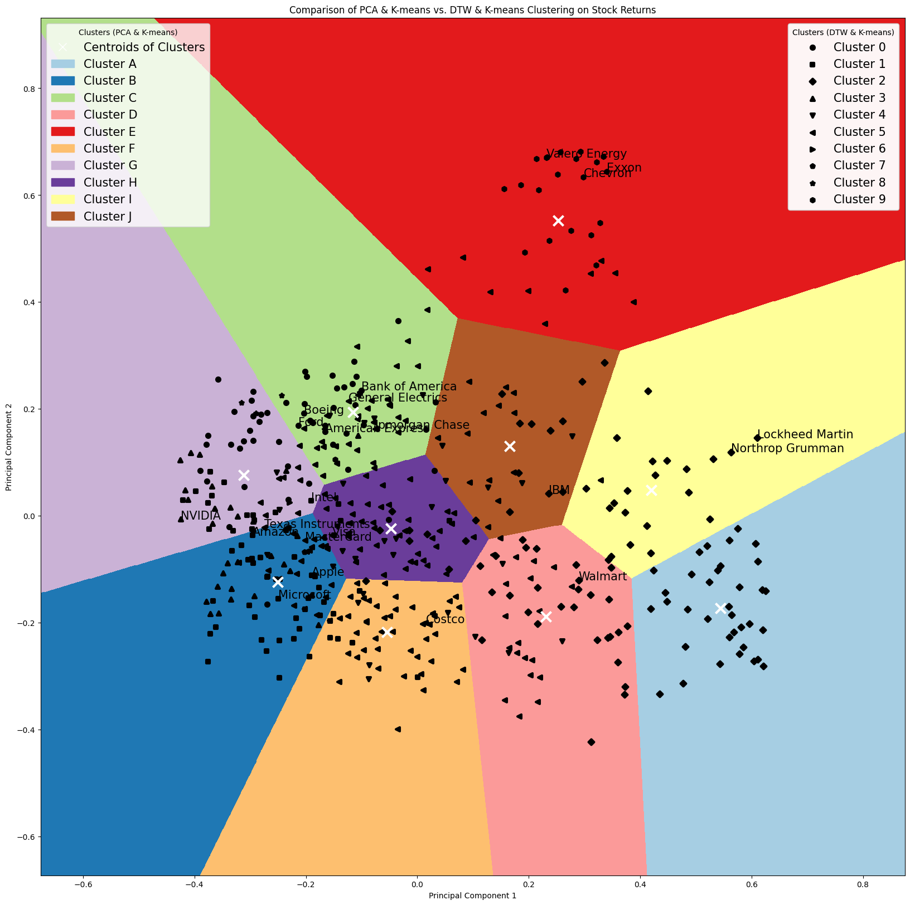

# Machine Learning Projects Repository

Welcome to my Machine Learning Projects Repository! This repository contains various machine learning and deep learning projects, with a particular focus on applications in Quantitative Finance. Additionally, some projects explore the methodology itself.

**Note:** This repository is currently a work in progress, and I am still in the process of uploading and organizing the projects. Please check back regularly for updates.

## Table of Contents

- [Projects](#projects)
  - [Principal Component Analysis (PCA) on Stock Market: Risks, Factors, and Movement Reconstruction](#principal-component-analysis-pca-on-stock-market-risks-factors-and-movement-reconstruction)
  - [Stock Clustering Analysis: K-means, PCA, and Dynamic Time Warping (DTW)](#stock-clustering-analysis-k-means-pca-and-dynamic-time-warping-dtw)
  - [Gaussian Naive Bayes, RandomizedSearchCV & Random Forest](#gaussian-naive-bayes-randomizedsearchcv--random-forest)
  - [Logistic Regression](#logistic-regression)
  - [Classification Evaluation](#classification-evaluation)
  - [Clustering](#clustering)
  - [CNN](#cnn)
  - [LSTM](#lstm)
  - [MLP](#mlp)
  - [Nearest Neighbors](#nearest-neighbors)
  - [GMM and LDA](#gmm-and-lda)
  - [Decision Trees](#decision-trees)
  - [SVM](#svm)
  - [Transformers](#transformers)
- [About Me](#about-me)
- [License](#license)

## Projects

### [Principal Component Analysis (PCA) on Stock Market: Risks, Factors, Movement Reconstruction](./PCA_on_Stock_Market)
This project demonstrates the application of Principal Component Analysis (PCA) to stock market data. The analysis showcases how to leverage PCA to identify major risks and factors influencing asset returns, reconstruct component portfolios, and backtest the suggested portfolios. This study focuses on the first principal component, with similar procedures applicable to the second and third components.

### [Stock Clustering Analysis: K-means, PCA, and Dynamic Time Warping (DTW)](./Clustering_Stock_Returns)
The project aims to cluster stocks based on their return patterns using two methods: PCA + K-means and DTW + K-means. The study will compare the results to highlight the strengths of each approach.

1. **PCA (Principal Component Analysis) + K-means**: PCA is used for dimensionality reduction, followed by K-means clustering.
2. **DTW (Dynamic Time Warping) + K-means**: DTW is used to measure the similarity between temporal sequences, followed by K-means clustering.

This study provides insights into the advantages of using DTW for clustering temporal data in financial markets, demonstrating its ability to account for lead-lag effects and other temporal relationships that PCA might overlook. 

### [Gaussian Naive Bayes, RandomizedSearchCV & Random Forest](./Gaussian_Naive_Bayes_RandomizedSearchCV_Random_Forest)

I created a comprehensive Jupyter notebook for predicting stock performance using Gaussian Naive Bayes, RandomizedSearchCV, and Random Forest. While it doesn't include a built trading strategy, it provides predicted probabilities for deciles that can be used to generate signals and strategies.

I developed a customized loss function to optimize trading outcomes and tailored models for long/short trading strategies. Stay tuned for the upcoming release in the [Quantitative-Strategy repository](https://github.com/justinyuchi/Quantitative-Strategy).

### Logistic Regression

### Classification Evaluation

### Clustering

### CNN

### LSTM

### MLP

### Nearest Neighbors

### GMM and LDA

### Decision Trees

### SVM

### Transformers

## About Me

I am a Master's student in Quantitative Finance with dual bachelor's degrees in Science and Business Administration. My academic focus includes artificial intelligence, statistics, and finance. Most of the projects in this repository are related to the application of machine learning and deep learning in Quantitative Finance, although some are dedicated to exploring the methodologies themselves. Visit my [personal website](https://justinyuchi.github.io/justinyuchihsu.github.io/) for more about my work and interests.

## License

This repository is licensed under the MIT License. See the [LICENSE](LICENSE) file for more details.
